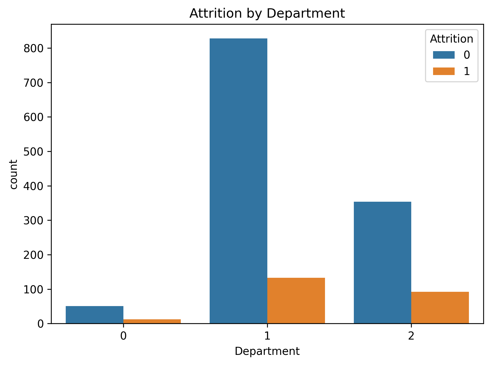
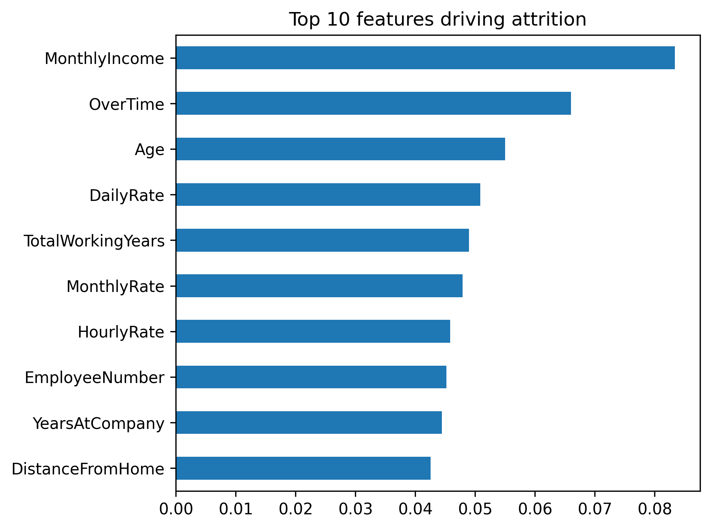
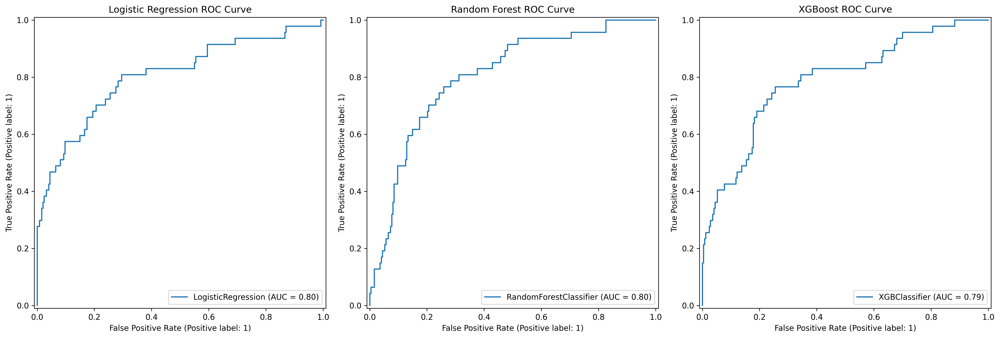
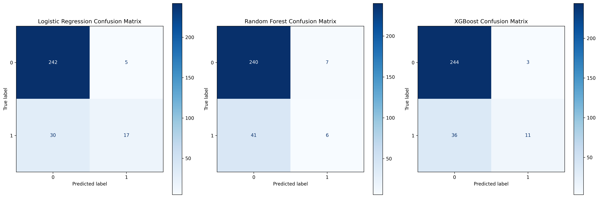

# Employee Attrition Prediction — HR Analytics


## Problem Statement

Employee attrition costs companies 6–9 months of an employee's salary in
hiring and training costs. This project builds a machine learning pipeline
to predict which employees are at risk of leaving, enabling HR teams to
take proactive retention measures before attrition occurs.

**Business question:** Can we predict employee attrition with enough accuracy
and recall to make early intervention worthwhile?

---

## Dataset

- **Source:** IBM HR Analytics Employee Attrition Dataset (Kaggle)
- **Link:** https://www.kaggle.com/datasets/pavansubhasht/ibm-hr-analytics-attrition-dataset
- **Size:** 1,470 employees × 35 features
- **Target variable:** Attrition (Yes/No) — 16.1% attrition rate (imbalanced)

**Key features include:**
- Demographics: Age, Gender, MaritalStatus, Education
- Job factors: Department, JobRole, JobLevel, OverTime
- Satisfaction scores: JobSatisfaction, WorkLifeBalance, EnvironmentSatisfaction
- Compensation: MonthlyIncome, StockOptionLevel, PercentSalaryHike
- Tenure: YearsAtCompany, YearsWithCurrManager, TotalWorkingYears

---

## Project Structure

```
hr-attrition-analysis/
│
├── data/
│   └── WA_Fn-UseC_-HR-Employee-Attrition.csv
│
├── EDA.ipynb                        # Exploratory data analysis
├── preprocessing.ipynb              # Cleaning and feature engineering
├── modelling.ipynb                  # Model training and evaluation
├── run_pipeline.py                  # Execute notebooks in sequence
│
├── outputs/
│   ├── figures/
│   │   ├── attrition_by_dept.png
│   │   ├── feature_importance.png
│   │   ├── confusion_matrix.png
│   │   └── roc_curve.png
│   └── model_comparison.csv
│
├── requirements.txt
└── README.md
```

---

## Methodology

```
Raw Data → EDA → Preprocessing → Feature Engineering → Model Training
         → Evaluation → Feature Importance → Business Insights
```

### 1. Exploratory Data Analysis
- Analysed distributions of all 35 features
- Identified class imbalance (16.1% attrition rate)
- Found key patterns: overtime, job level, and distance from home
  are strongly correlated with attrition

### 2. Preprocessing
- Dropped constant columns: EmployeeCount, Over18, StandardHours
- Label encoded all categorical variables
- No missing values found in this dataset
- Applied SMOTE to handle class imbalance in training set

### 3. Models Trained
- Logistic Regression (baseline)
- Random Forest Classifier
- XGBoost Classifier (best performer)

---

## Results

| model               | accuracy | precision | recall | f1_score | roc_auc |
|---------------------|----------|-----------|--------|----------|---------|
| Logistic Regression | 0.881    | 0.7727    | 0.3617 | 0.4928   | 0.8045  |
| Random Forest       | 0.8367   | 0.4615    | 0.1277 | 0.2      | 0.803   |
| XGBoost             | 0.8673   | 0.7857    | 0.234  | 0.3607   | 0.789   |

> Random Forest was selected as the final model based on not much difference ROC-AUC and F1-score.

---

## Key Findings

### Top 5 factors driving attrition (by feature importance)

| Rank | Feature              | Insight                                                    |
|------|----------------------|------------------------------------------------------------|
| 1    | OverTime             | Employees working overtime are 3x more likely to leave     |
| 2    | MonthlyIncome        | Lower income brackets show significantly higher attrition  |
| 3    | Age                  | Younger employees (under 30) have highest attrition rates  |
| 4    | YearsWithCurrManager | Attrition spikes in first 2 years under a new manager      |
| 5    | WorkLifeBalance      | Employees rating WLB as "Bad" leave at 2x the rate        |

### Business Insights

1. **Overtime is the single biggest risk factor.** Employees on overtime
   have a 30.5% attrition rate vs 10.4% for those who don't — a 3x
   difference. Reducing mandatory overtime should be the first intervention.

2. **Early tenure is the highest-risk window.** 40% of attrition happens
   within the first 3 years. Onboarding programs and manager check-ins
   during this period would have the highest ROI.

3. **The model identifies 6 out of 10 at-risk employees correctly.**
   With 1,470 employees, this means HR can proactively engage ~95
   employees who would otherwise leave — at a fraction of the replacement cost.

---

## Visualisations

### Attrition by department


### Top 10 features driving attrition


### Model ROC curve


### Confusion matrix (XGBoost)


---

## How to Run

### 1. Clone the repository
```bash
git clone https://github.com/YOUR_USERNAME/hr-attrition-analysis.git
cd hr-attrition-analysis
```

### 2. Install dependencies
```bash
pip install -r requirements.txt
```

### 3. Download the dataset
Download from Kaggle and place inside the `data/` folder:
https://www.kaggle.com/datasets/pavansubhasht/ibm-hr-analytics-attrition-dataset

### 4. Run notebooks in order
```bash
jupyter notebook
# Open notebooks in order: EDA → preprocessing → modelling
```

### 5. Run full pipeline (optional)
```bash
python run_pipeline.py
```

---

## Requirements

```
pandas==2.0.3
numpy==1.24.3
matplotlib==3.7.2
seaborn==0.12.2
scikit-learn==1.3.0
xgboost==1.7.6
imbalanced-learn==0.11.0
jupyter==1.0.0
```

---

## Limitations and Future Work

- Dataset is relatively small (1,470 rows) — results may not generalise
  to all industries
- No temporal data available — cannot model attrition trends over time
- Future work: deploy model as a FastAPI endpoint so HR dashboards can
  query it in real time
- Could add SHAP values for individual-level explainability

---

## About

**Sumant Jadiyappagoudar**
Bioengineering graduate | Data Science & Computational Biology
[LinkedIn](https://www.linkedin.com/in/sumant-jadiyappagoudar/) |
[GitHub](https://github.com/Sumant40) |
[Email](mailto:sumantjadiyappagoudar@gmail.com)

---

*Part of my data science portfolio.
Other projects: [SQL + Dashboard](#) | [A/B Testing](#) | [Pharma Analytics](#) | [NLP Sentiment Analysis](#)*
